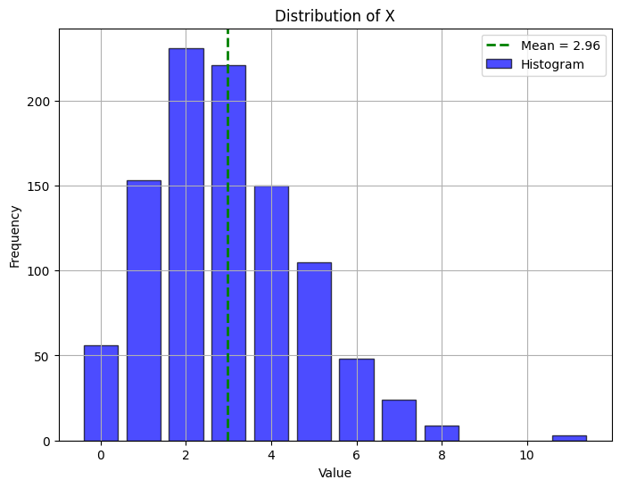

# ProbPy
---
ProbPy is a Python library for modeling and manipulating stochastic variables and probability distributions. It provides tools for statistical analysis, transformations, Monte Carlo simulations, and visualizations, making it easier to work with random processes and probabilistic models.


The following demonstration provides a comprehensive guide on how to effectively utilize the library. It walks you through the essential features and functionalities, showcases practical examples, and illustrates best practices to help you integrate the library seamlessly into your projects. 

## Initialization
We will begin by importing some useful classes and functions from the library. The library consists of six modules:
- `probpy.core`: containing core functionalities of the library.
- `probpy.distributions`: containing distributions
- `probpy.plots`: containing functions for plotting
- `probpy.transformations`: containing functions used to transform sotchastic variables
- `probpy.goodness_of_fit`: containing functions that can be used to test whether a stochastic variable follows a certain distribution
- `probpy.monte_carlo`: containing functions that can be used to perform monte carlo simulations


```python
from probpy.core import StochasticVariable, set_random_seed
import numpy as np
```

A good practice when performing probabilistic experiments is to specify the random seed. By setting the seed, you ensure that the sequence of random numbers generated is reproducible. This is particularly useful for debugging, testing, and scenarios where consistent results are needed across multiple runs.


```python
set_random_seed(1)
```

### Defining stochastic variables

The ProbPy library is built around the concept of stochastic variables. In this library, stochastic variables are instances of the `StochasticVariable` class. These objects behave intuitively by having associated distributions and the capability to be sampled.

By default, a stochastic variable follows a continuous uniform distribution on the unit interval. However, you can specify a different distribution if needed. Various distributions are available and can be imported from the `probpy.distributions` module, which includes the most commonly used distributions:

#### Discrete Distributions
- `DiscreteUniformDistribution(a, b)`: Represents a discrete uniform distribution where integers from `a` to `b` (inclusive) are equally likely.
- `BernoulliDistribution(p)`: Represents a Bernoulli distribution with success probability `p` ($0 \leq p \leq 1$).
- `BinomialDistribution(n, p)`: Represents a binomial distribution with `n` trials and success probability `p`.
- `GeometricDistribution(p)`: Represents a geometric distribution with success probability `p`.
- `HypergeometricDistribution(M, n, N)`: Represents a hypergeometric distribution:
  - `M`: Total population size.
  - `n`: Number of success states in the population.
  - `N`: Number of draws.
- `PoissonDistribution(mu)`: Represents a Poisson distribution with mean $\mu$.
- `NegativeBinomialDistribution(n, p)`: Represents a negative binomial distribution with `n` successes and success probability `p`.
- `MultinomialDistribution(n, p)`: Represents a multinomial distribution with `n` trials and a sequence of probabilities `p` that sums to 1.

#### Continuous Distributions
- `ContinuousUniformDistribution(a, b)`: Represents a continuous uniform distribution over the interval $[a, b]$.
- `ExponentialDistribution(lambd)`: Represents an exponential distribution with rate parameter $\lambda$ ($lambd > 0$).
- `NormalDistribution(mu, sigma)`: Represents a normal (Gaussian) distribution with mean $\mu$ and standard deviation $\sigma$.
- `LogNormalDistribution(s, scale)`: Represents a log-normal distribution:
  - `s`: Shape parameter ($\sigma$ of the underlying normal distribution).
  - `scale`: Scale parameter ($e^{\mu}$ of the underlying normal distribution).
- `GammaDistribution(shape, scale)`: Represents a gamma distribution:
  - `shape`: Shape parameter ($k$ or $\alpha$).
  - `scale`: Scale parameter ($\theta$).
- `ChiSquaredDistribution(df)`: Represents a chi-squared distribution with degrees of freedom `df`.
- `RayleighDistribution(scale)`: Represents a Rayleigh distribution with scale parameter $\sigma$.
- `BetaDistribution(a, b)`: Represents a beta distribution with parameters $a > 0$ and $b > 0$.
- `CauchyDistribution(x0, gamma)`: Represents a Cauchy distribution:
  - `x0`: Location parameter (median).
  - `gamma`: Scale parameter (half-width at half-maximum).
- `StandardArcsineDistribution()`: Represents the standard arcsine distribution on the interval $[0, 1]$.
- `DirichletDistribution(alpha)`: Represents a Dirichlet distribution with concentration parameters `alpha` (all elements > 0).


```python
# Define a stochastic variable.
# By default, an instance of the StochasticVariable class is uniformly distributed on the unit interval
X = StochasticVariable()

# Sample the stochastic variable
print(X.sample())

# Produce multiple samples at once
print(X.sample(10))
```

    0.417022004702574
    [7.20324493e-01 1.14374817e-04 3.02332573e-01 1.46755891e-01
     9.23385948e-02 1.86260211e-01 3.45560727e-01 3.96767474e-01
     5.38816734e-01 4.19194514e-01]
    

It is both possible and good practice to assign each stochastic variable a unique name. The library is designed to prevent two stochastic variables with the same name from existing simultaneously. This restriction helps avoid circular dependencies and similar issues, ensuring the integrity and reliability of your probabilistic models.


```python
# The brightness of a light
Y = StochasticVariable(name="Brightness")

# print(Y) prints the assigned name
print(Y)
```

    Brightness
    

A stochastic variable with a specific distribution can be defined as follows. 


```python
from probpy.distributions import NormalDistribution

# Define a standard normally distributed variable
Z = StochasticVariable(NormalDistribution(mu=0, sigma=1), name="Z")

print(Z.sample(10))
```

    [-1.01701414  0.63736181 -0.85990661  1.77260763 -1.11036305  0.18121427
      0.56434487 -0.56651023  0.7299756   0.37299379]
    

The distribution of a variable can be changed if it is not in use by any other stochastic variable.


```python
from probpy.distributions import ExponentialDistribution

# Define an exponentially distributed varaible with lambda=2
Z.set_distribution(ExponentialDistribution(lambd=2))

print(Z.sample(10))
```

    [1.12502793 0.04443977 0.01991894 0.09306264 1.05245149 0.05176267
     0.27331935 1.58372944 0.38089001 0.5886283 ]
    

Stochastic variables can be combined using standard arithmetic operations such as + or -. Additionally, they can be combined more flexibly using the `apply` function from the `probpy.core` module, allowing for custom operations and transformations.


```python

X = StochasticVariable(NormalDistribution(0,1), name="X")
Y = StochasticVariable(ExponentialDistribution(1.5), name="Y")

Z = X + Y

# Combination of stochastic variables are assigned default names
print(Z)

# The name can be updated after combination
Z.name = "Z"

print(Z)

print(Z.sample(10))
```

    X + Y
    Z
    [ 1.23480579 -1.11655719 -0.09285109  1.11934358 -0.01166563  0.60947085
      0.90997763  0.45767799 -0.93225371 -0.41620933]
    

It is easy to plot the distribution of any stochastic variable. For this one can use the `plot_distribution` function from the `probpy.plots` module. Note that any plot of the distribution is based on samples from the stochastic variable, and not the underlying analytical distribution. Thus, the plot shows an estimation of the real distribution.


```python
from probpy.plots import plot_distribution

plot_distribution(Z)
```


    

    


Any instance of the `StochasticVariable` class has a wide range of statistical methods:
- `pdf(x)`: the probability density function of the variable (defaults to `empirical_pdf` if the analytical PDF is not available).
- `pmf(x)`: the probability mass function of the variable (defaults to `empirical_pmf` if the analytical PMF is not available)
- `cdf(x)`: Cumulative distribution function of the variable (defaults to `empirical_cdf` if the analytical CDF is not available)
- `mean(size)`: calculates the mean of the stochastic variable based on `size` samples.
- `std(size)`: calculates the standard deviation of the stochastic variable based on `size` samples.
- `var(size)`: calculates the variance of the stochastic variable based on `size` samples.
- `median(size)`: calculates the median of the stochastic variable based on `size` samples.
- `mode(size)`: calculates the mode of the stochastic variable based on `size` samples.
- `nth_moment(size)`: calculates the $n$th moment of the stochastic variable based on `size` samples.
- `mean_confidence_interval(size, confidence_level)`: calculates a confidence interval of the mean of the stochastic variable based on `size` samples and with confidence level `confidence_level`.
- `variance_confidence_interval(size, confidence_level)`: calculates a confidence interval of the variance of the stochastic variable based on `size` samples and with confidence level `confidence_level`.
- `confidence_interval(size, confidence_level)`: calculates a confidence interval of the stochastic variable based on `size` samples and with confidence level `confidence_level`.


```python

X = StochasticVariable(ExponentialDistribution(3), name="X")
Y = StochasticVariable(NormalDistribution(-2, 4), name="Y")

Z = X + Y

print("Summary of Z:\n")
print("Mean:", Z.mean())
print("Standard deviation:", Z.std())
print("Variance:", Z.var())
print("Median:", Z.median())
print("Mode:", Z.mode())
print("nth moment:", Z.nth_moment(4))
print("Confidence interval of the mean of Z:", Z.mean_confidence_interval())
print("Confidence interval of the variance of Z:", Z.variance_confidence_interval())
print("Confidence interval of Z:", Z.confidence_interval())
```

    Summary of Z:
    
    Mean: -1.6502189618157412
    Standard deviation: 3.9913929432617126
    Variance: 16.15595553051518
    Median: -1.7052577640988602
    Mode: -1.4865815097515842
    nth moment: 1066.3703633255077
    Confidence interval of the mean of Z: (-1.7399811148866853, -1.5827442921127979)
    Confidence interval of the variance of Z: (15.64232745484988, 16.534054891890246)
    Confidence interval of Z: (-9.531454542500288, 6.091323195286024)
    

One can also simply use the `summary()` method of the stochastic variable to display key statistics. Note that
skewness and kurtosis are calculated as the 3rd and 4th moments, respectively. That is, $\text{Skewness} = \mu_3 / \sigma^3$ and $\text{Kurtosis} = \mu_4 / \sigma^4$.


```python
Z.summary()
```

    ------------------------------------------------------------
    Summary of X + Y
    ------------------------------------------------------------
    Mean:     -1.648248938238822
    Variance: 15.922126025495475
    Skewness: -78.15765782942302
    Kurtosis: 1086.6235091847827
    ------------------------------------------------------------
    

The `probpy.core`module includes the function `apply` that can be used to transform combine stochastic variables arbitrarily. The apply takes a callable as input along with the neccesary arguments required by the callable. These arguments may be stochastic variables.


```python

from probpy.core import apply

X = StochasticVariable(NormalDistribution(-4,5), name="X")

Z = apply(lambda x: x**3+2*x**2+1000, X, name="Z")

Z.summary()

plot_distribution(Z)
```

    ------------------------------------------------------------
    Summary of Z
    ------------------------------------------------------------
    Mean:     709.1107143790383
    Variance: 545446.3957428848
    Skewness: -8203431.2336169435
    Kurtosis: 7046037347099.526
    ------------------------------------------------------------
    


    

    


Everything that has been shown so far, also works for discrete variables.


```python

from probpy.distributions import DiscreteUniformDistribution

X = StochasticVariable(DiscreteUniformDistribution(-2,2), name="X")

X.summary()

plot_distribution(X)

```

    ------------------------------------------------------------
    Summary of X
    ------------------------------------------------------------
    Mean:     -0.0328
    Variance: 2.0088286328632865
    Skewness: -0.0733
    Kurtosis: 6.9071
    ------------------------------------------------------------
    


    

    


The parameters of the distribution of a stochsatic variable can also be stochastic variables.


```python

X = StochasticVariable(ExponentialDistribution(1), name="X")
Y = StochasticVariable(NormalDistribution(0, X), name="Y")

Y.summary()

plot_distribution(Y)
```

    ------------------------------------------------------------
    Summary of Y
    ------------------------------------------------------------
    Mean:     0.02331495695450498
    Variance: 2.059166537608933
    Skewness: -0.8932028214102605
    Kurtosis: 111.7468806845342
    ------------------------------------------------------------
    


    

    


### Transformations

For transforming stochastic varaibles, one can also use the `probpy.transformations` module, which includes the following functions. These functions return stochastic varaibles if the input is stochastic.
- `exp(X)`: Calculates the exponential function of a stochastic variable.
- `expm1(X)`: Calculates $ e^X - 1 $, the exponential function minus one.
- `log(X)`: Computes the natural logarithm ($\ln$) of a stochastic variable.
- `log10(X)`: Computes the base-10 logarithm of a stochastic variable.
- `log2(X)`: Computes the base-2 logarithm of a stochastic variable.
- `log1p(X)`: Computes $\ln(1 + X)$, the natural logarithm of $1 + X$.
- `sqrt(X)`: Computes the square root of a stochastic variable.
- `square(X)`: Computes the square of a stochastic variable ($X^2$).
- `power(X, y)`: Raises a stochastic variable $X$ to the power $y$ ($X^y$).
- `cbrt(X)`: Computes the cube root of a stochastic variable.
- `reciprocal(X)`: Computes the reciprocal of a stochastic variable ($1 / X$).
- `sin(X)`: Computes the sine of a stochastic variable (in radians).
- `cos(X)`: Computes the cosine of a stochastic variable (in radians).
- `tan(X)`: Computes the tangent of a stochastic variable (in radians).
- `arcsin(X)`: Computes the inverse sine ($\sin^{-1}$) of a stochastic variable.
- `arccos(X)`: Computes the inverse cosine ($\cos^{-1}$) of a stochastic variable.
- `arctan(X)`: Computes the inverse tangent ($\tan^{-1}$) of a stochastic variable.
- `arctan2(X, Y)`: Computes the arc tangent of $Y/X$, accounting for the signs of both arguments.
- `hypot(X, Y)`: Computes the Euclidean norm ($\sqrt{X^2 + Y^2}$) of two stochastic variables.
- `sinh(X)`: Computes the hyperbolic sine of a stochastic variable.
- `cosh(X)`: Computes the hyperbolic cosine of a stochastic variable.
- `tanh(X)`: Computes the hyperbolic tangent of a stochastic variable.
- `arcsinh(X)`: Computes the inverse hyperbolic sine ($\sinh^{-1}$) of a stochastic variable.
- `arccosh(X)`: Computes the inverse hyperbolic cosine ($\cosh^{-1}$) of a stochastic variable.
- `arctanh(X)`: Computes the inverse hyperbolic tangent ($\tanh^{-1}$) of a stochastic variable.
- `round_(X, decimals=0)`: Rounds a stochastic variable to a specified number of decimal places.
- `floor(X)`: Computes the floor (largest integer $\leq X$) of a stochastic variable.
- `ceil(X)`: Computes the ceiling (smallest integer $\geq X$) of a stochastic variable.
- `trunc(X)`: Truncates a stochastic variable to its integer part.
- `clip(X, a_min, a_max)`: Clips the values of a stochastic variable to fall within a specified range $[a_{\text{min}}, a_{\text{max}}]$.
- `abs_(X)`: Computes the absolute value of a stochastic variable.
- `sign(X)`: Computes the sign of a stochastic variable ($-1$, $0$, or $1$).
- `min_(*Xs)`: Computes the element-wise minimum of multiple stochastic variables.
- `max_(*Xs)`: Computes the element-wise maximum of multiple stochastic variables.
- `sum_(*Xs)`: Computes the sum of multiple stochastic variables and assigns a descriptive name to the resulting variable.


```python

from probpy.distributions import BinomialDistribution
import probpy as pp

X = StochasticVariable(BinomialDistribution(4, 0.6), name="X")

Y = pp.exp(X)

Y.summary()

plot_distribution(Y)
```

    ------------------------------------------------------------
    Summary of exp(X)
    ------------------------------------------------------------
    Mean:     16.904454932774787
    Variance: 259.18366692226874
    Skewness: 24193.64360771619
    Kurtosis: 1169111.014071847
    ------------------------------------------------------------
    


    

    


## Calculating probabilities

The `probpy.core` module includes te function `probability` that can be used to calculate the probability of certain events. The function takes a boolean callable as input as well as the corresponding number of arguments, similar to the `apply` function. Note that the probability is based on emperical sampling and thus only an estimate of the true probability. 


```python

from probpy.distributions import PoissonDistribution
from probpy.core import probability

X = StochasticVariable(PoissonDistribution(3), name="X")

print("P(X > 4) =", probability(lambda x: x > 4, X))

plot_distribution(X)
```

    P(X > 4) = 0.1874
    


    

    


A confidence for the probability can be calculated by saving the probability as a stochastic variable.


```python

from probpy.distributions import PoissonDistribution
from probpy.core import probability

X = StochasticVariable(PoissonDistribution(3), name="X")

# Returns the probability as a stochastic variable
P = probability(lambda x: x > 4, X, stochastic=True, name="P")

print("Confidence interval for P(X > 4)", P.confidence_interval())

```

    Confidence interval for P(X > 4) (0.161, 0.21)
    


```python

```

Probability calculations are allowed to include multiple stochastic variables.


```python

X = StochasticVariable(ExponentialDistribution(1), name="X")
Y = StochasticVariable(NormalDistribution(0, X), name="Y")

P = probability(lambda x, y: y + x > 0, X, Y, stochastic=True, name="P")

P.summary()

plot_distribution(P)
```

    ------------------------------------------------------------
    Summary of P
    ------------------------------------------------------------
    Mean:     0.8413298999999999
    Variance: 0.00013429712567256745
    Skewness: 0.5956825780809
    Kurtosis: 0.5014871547860781
    ------------------------------------------------------------
    


    

    


```python
plot_distribution(X+Y)
```


    

    


### Stochastic vectors and matrices

The `probpy.core` module include the classes `StochasticVector` and `StochasticMatrix` which allow the user to perform operations with vectors and matrices containing stochastic variables. 

#### Stochastic vectors

The `StochasticVector` class has the following methods:

- `sample(size=1, context=None)`: Generates samples from all component variables.
- `append(element)`: Adds a new element (number or `StochasticVariable`) to the vector.
- `insert(index, element)`: Inserts an element (number or `StochasticVariable`) at a specified position in the vector.
- `pop(identifier=None)`: Removes and returns an element by its position or name. Defaults to the last element if no identifier is provided.
- emove(identifier)`: Removes an element by position, name, or `StochasticVariable` instance.
- `print()`: Prints a representation of the vector.
- `length()`: Returns the number of components in the vector.
- `norm(p=2)`: Computes the $p$-norm of the vector (default is the $L2$-norm).
- `dot(other)`: Computes the dot product with another `StochasticVector`.
- `cross(other)`: Computes the cross product with another 3D `StochasticVector`.

In the above, the parameter `identifier` refers to either the index of a stochastic varaible or the name of a stochastic variable.


```python

from probpy.core import StochasticVector

X = StochasticVariable(NormalDistribution(0,1), name="X")
Y = StochasticVariable(NormalDistribution(0,1), name="Y")

V1 = StochasticVector(X, Y, 1/2, name="V1")
V2 = StochasticVector(1, 2, X, name="V2")

print(V1)
print(V2)

print(V1.sample())
print(V2.sample())

```

    [X, Y, 0.5]
    [1, 2, X]
    [-1.7743466414040037, 0.6123927134758784, 0.5]
    [1.0, 2.0, 0.4298832916671139]
    


```python
# Append elements to a vector
V1.append(X)

print(V1)

print(V1.sample(2))
```

    [X, Y, 0.5, X]
    [[0.9015296413803433, 1.3084037962729504, 0.5, 0.9015296413803433], [0.9692997604357816, -0.5077683246403369, 0.5, 0.9692997604357816]]
    

Calculating the cross product of two stochastic vector return a new stochastic vector, while calculating the norm or dot product returns a stochastic variable.


```python

X = StochasticVariable(NormalDistribution(0,1), name="X")
Y = StochasticVariable(NormalDistribution(0,1), name="Y")

V1 = StochasticVector(X, Y, 1/2, name="V1")
V2 = StochasticVector(1, 2, X, name="V2")


# Calculating the cross product of two vectors
V3 = V1.cross(V2)

print(V3)

plot_distribution(V3[1])
```

    [cross(V1, V2)_x, cross(V1, V2)_y, cross(V1, V2)_z]
    


    

    


```python
# Calculating the dot product of two vectors
Z = V1.dot(V2)

# Calculating the 2-norm of a vector
N = V1.norm()

print(N)
print(Z)

N.summary()
Z.summary()
```

    (V1)_norm_2
    dot(V1, V2)
    ------------------------------------------------------------
    Summary of (V1)_norm_2
    ------------------------------------------------------------
    Mean:     1.3803482442340549
    Variance: 0.3556024128540062
    Skewness: 4.3140106576284065
    Kurtosis: 9.25574962842837
    ------------------------------------------------------------
    ------------------------------------------------------------
    Summary of dot(V1, V2)
    ------------------------------------------------------------
    Mean:     -0.026879600804630168
    Variance: 6.313235544026866
    Skewness: 0.7366929900975743
    Kurtosis: 113.75284604831143
    ------------------------------------------------------------
    

#### Stochastic matrices

The `StochasticMatrix` class has the following methods:
- `transpose()`: Returns the transpose of the stochastic matrix.
- `T`: Property method that provides the transpose of the stochastic matrix (alias for `transpose()`).
- `matmul(other)`: Performs matrix multiplication:
  - If `other` is a `StochasticMatrix`, computes the matrix product.
  - If `other` is a `StochasticVector`, computes the product between the matrix and the vector.
  - Raises an error if the dimensions of the operands do not align or if the operand type is unsupported.


```python

from probpy.core import StochasticMatrix

X = StochasticVariable(NormalDistribution(0,1), name="X")
Y = StochasticVariable(ExponentialDistribution(2), name="Y")

M = StochasticMatrix([[X, 1/2],[Y, X+Y]], name="M")

print(M)

print(M.T)

print(M @ M.T)


```

    
    [[X, 0.5],
     [Y, X + Y]]
    
    
    [[X, Y],
     [0.5, X + Y]]
    
    
    [[(X * X) + (0.5 * 0.5), (X * Y) + (0.5 * (X + Y))],
     [(Y * X) + ((X + Y) * 0.5), (Y * Y) + ((X + Y) * (X + Y))]]
    
    

Matrices can be used to transform vectors.


```python
V = StochasticVector(X, Y, name="V")

Transformed_V = M @ V
Transformed_V.name = "Transformed_V"

print(Transformed_V)

plot_distribution(Transformed_V.norm())

```

    [(X * X) + (0.5 * Y), (Y * X) + ((X + Y) * Y)]
    


    

    


### Dependency graphs

The `probpy.plots` module contains the function `plot_dependency_graph` which takes as input one or multiple stocastic objects (variable, vector, or matrix) and plots a graph showing the dependencies of the object(s) as a graph. For example, using the matrix from the previous example, we get the plot bellow.


```python
from probpy.plots import plot_dependency_graph

plot_dependency_graph(M)
```


    

    


    <networkx.classes.digraph.DiGraph at 0x25f6e927cb0>


One can use the `depth` parameter of the `plot_dependency_graph` function to specify te depth of the graph.


```python
plot_dependency_graph(M, depth=2)
```


    

    


    <networkx.classes.digraph.DiGraph at 0x25f6e81eea0>


## Goodness of fit


The `probpy.goodness_of_fit` module provides two functions, `kolmogorov_smirnov_test(subject, X, summary=True, alpha=0.05)` and `chi_square_test(subject, X, summary=True, alpha=0.05)`. These functions can be used to evaluate whether a stochastic variable or a list of numbers (`X`) conforms to a specified distribution or the distribution of another stochastic variable (`subject`).


```python
from probpy.distributions import ContinuousUniformDistribution
from probpy.distributions import CustomDistribution
from probpy.goodness_of_fit import chi_square_test, kolmogorov_smirnov_test
import probpy as pp


X = StochasticVariable(ContinuousUniformDistribution(0,1), name="X")
Y = StochasticVariable(ContinuousUniformDistribution(0,1), name="Y")

Z = pp.max_(X, Y)

# The true cdf of Z is F(x)=x^2 so pdf(x) = 2x
true_distribution = CustomDistribution(lambda x: 2*x, domain=(0,1))

chi_square_test(true_distribution, Z)
kolmogorov_smirnov_test(true_distribution, Z)

```

    
    --------------------------------------------------------------------
                              Chi-square test
    --------------------------------------------------------------------
    Chi-Square Statistic: 27.238579751638735
    P-value: 0.5052855598000592
    
    The StochasticVariable max(X, Y) fits the distribution 
    CONCLUSION: fail to reject the null hypothesis.
    --------------------------------------------------------------------
    
    Note: The p-value represents the probability of observing results as 
    extreme as the current data, assuming the null hypothesis is true.
    A low p-value (e.g., ≤ 0.05) indicates strong evidence against the 
    null hypothesis, while a high p-value suggests the data is 
    consistent with the null hypothesis.
    
    
    --------------------------------------------------------------------
                             Kolmogorov-Smirnov test
    --------------------------------------------------------------------
    KS Statistic: 0.010005908997324342
    P-value: 0.2675892708126909
    
    The StochasticVariable max(X, Y) fits the distribution. 
    CONCLUSION: fail to reject the null hypothesis.
    --------------------------------------------------------------------
    
    Note: The p-value represents the probability of observing results as 
    extreme as the current data, assuming the null hypothesis is true.
    A low p-value (e.g., ≤ 0.05) indicates strong evidence against the 
    null hypothesis, while a high p-value suggests the data is 
    consistent with the null hypothesis.
    
    


    (0.010005908997324342, 0.2675892708126909)


## Monte Carlo simulation

The `probpy.monte_carlo` module contains the following functions:

- `monte_carlo_simulate(model, variables, trials=DEFAULT_STATISTICS_SAMPLE_SIZE, seed=None)`: Performs a Monte Carlo simulation by sampling inputs from stochastic variables, evaluating a model, and returning the results as a NumPy array.
- `summarize_simulation(results, confidence_level=0.95)`: Provides statistical summaries of the simulation results, including mean, variance, standard deviation, median, and confidence intervals.
- `plot_simulation(results, bins=30, density=True, title="Monte Carlo Simulation Results")`: Visualizes the simulation results with a histogram and optionally overlays a kernel density estimate (KDE) curve.


Let us try to estimate $\pi$ using Monte Carlo simulation.


```python
from probpy.monte_carlo import monte_carlo_simulate, summarize_simulation, plot_simulation

X = StochasticVariable(ContinuousUniformDistribution(-1, 1))
Y = StochasticVariable(ContinuousUniformDistribution(-1, 1))

def model(x, y):
    return x**2 + y**2 <= 1  # is in unit circle

results = monte_carlo_simulate(model=model, 
                               variables=[X, Y],
                               num_trials=10000000,
                               seed=42)

pi_estimate = 4 * np.mean(results)

print(pi_estimate)
```

    3.1417068
    

Monte Carlo simulation can be used to estimate an integral, based on the following result:

$$\int_a^b f(x)dx\approx \frac{b-a}{N}\sum_{i=1}^Nf(x_i).$$

Let us try to estimate the following integral:

$$\int_0^\pi \sin(x)dx\approx \frac{\pi}{N}\sum_{i=1}^N\sin(x_i).$$


```python
a = 0
b = np.pi

X = StochasticVariable(ContinuousUniformDistribution(a, b))

results = monte_carlo_simulate(model=np.sin,
                               variables=[X],
                               num_trials=1000000,
                               seed=42)

# Estimate the integral (the correct value is 2)
integral_estimate = (b - a) * np.mean(results)

summary = summarize_simulation(results)

print(f"Estimated integral of sin(x) from {a} to {b}: {integral_estimate:.6f}")
```

    Estimated integral of sin(x) from 0 to 3.141592653589793: 2.000621
    
