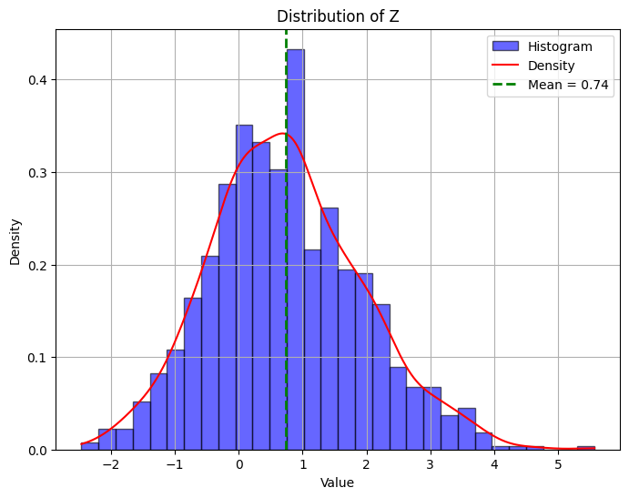
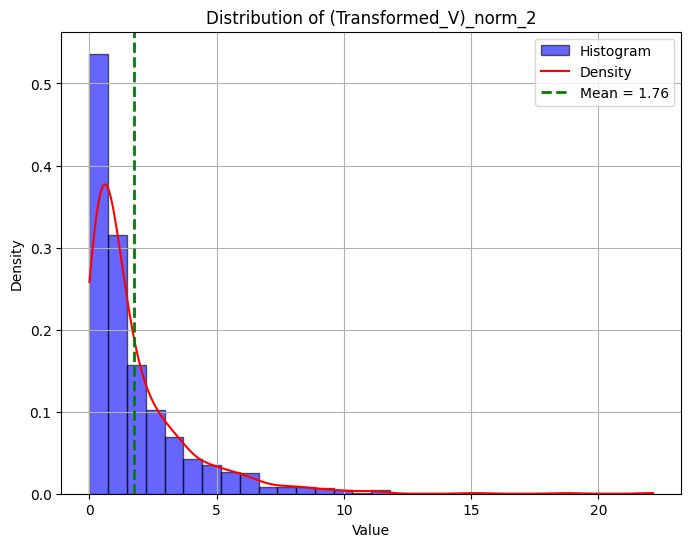
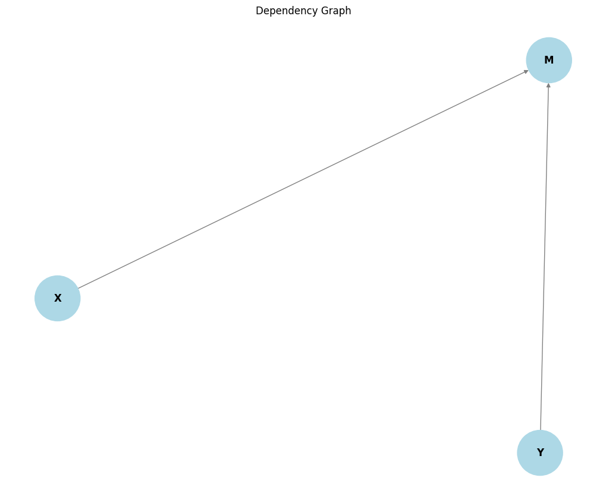

# ProbPy Documentation

---

ProbPy is a Python library for modeling and manipulating stochastic variables and probability distributions. It provides tools for statistical analysis, transformations, Monte Carlo simulations, and visualizations, making it easier to work with random processes and probabilistic models.

This documentation offers a comprehensive guide on how to effectively utilize the library. It walks you through the essential features and functionalities, showcases practical examples, and illustrates best practices to help you integrate ProbPy seamlessly into your projects.

## Table of Contents

- [Installation](#installation)
- [Modules Overview](#modules-overview)
- [Initialization](#initialization)
- [Defining Stochastic Variables](#defining-stochastic-variables)
- [Statistical Methods](#statistical-methods)
- [Transformations](#transformations)
- [Calculating Probabilities](#calculating-probabilities)
- [Stochastic Vectors and Matrices](#stochastic-vectors-and-matrices)
- [Dependency Graphs](#dependency-graphs)
- [Goodness of Fit Tests](#goodness-of-fit-tests)
- [Monte Carlo Simulation](#monte-carlo-simulation)
- [Source Code Reference](#source-code-reference)

---

## Installation

To install ProbPy, clone the repository and install the required dependencies:

```bash
git clone https://github.com/FrederikDanielsen/probpy.git
cd probpy
pip install -r requirements.txt
```

## Modules Overview

ProbPy consists of the following modules:

- **`probpy.core`**: Core functionalities of the library, including classes for stochastic variables, vectors, and matrices.
- **`probpy.distributions`**: A collection of predefined probability distributions.
- **`probpy.plots`**: Functions for visualizing distributions and dependencies.
- **`probpy.transformations`**: Functions used to transform stochastic variables.
- **`probpy.goodness_of_fit`**: Functions to test whether a stochastic variable follows a certain distribution.
- **`probpy.monte_carlo`**: Functions to perform Monte Carlo simulations.

## Initialization

Begin by importing the necessary classes and functions:

```python
from probpy.core import StochasticVariable, set_random_seed
import numpy as np
```

It's good practice to set a random seed for reproducibility:

```python
set_random_seed(1)
```

## Defining Stochastic Variables

In ProbPy, stochastic variables are instances of the `StochasticVariable` class. By default, a stochastic variable follows a continuous uniform distribution on the unit interval.

### Basic Usage

```python
# Define a stochastic variable with default distribution
X = StochasticVariable()

# Sample the stochastic variable
print(X.sample())

# Produce multiple samples at once
print(X.sample(10))
```

**Output:**

```
0.417022004702574
[0.72032449 0.00011437 0.30233257 0.14675589 0.09233859 0.18626021
 0.34556073 0.39676747 0.53881673 0.41919451]
```

### Naming Variables

Assigning unique names to stochastic variables is encouraged:

```python
# The brightness of a light
Y = StochasticVariable(name="Brightness")

print(Y)
```

**Output:**

```
Brightness
```

### Specifying Distributions

You can define a stochastic variable with a specific distribution:

```python
from probpy.distributions import NormalDistribution

# Define a standard normally distributed variable
Z = StochasticVariable(NormalDistribution(mu=0, sigma=1), name="Z")

print(Z.sample(10))
```

**Output:**

```
[-1.01701414  0.63736181 -0.85990661  1.77260763 -1.11036305  0.18121427
  0.56434487 -0.56651023  0.7299756   0.37299379]
```

### Changing Distributions

You can change the distribution of a variable if it's not in use by other variables:

```python
from probpy.distributions import ExponentialDistribution

# Update Z to follow an exponential distribution with lambda=2
Z.set_distribution(ExponentialDistribution(lambd=2))

print(Z.sample(10))
```

**Output:**

```
[1.12502793 0.04443977 0.01991894 0.09306264 1.05245149 0.05176267
 0.27331935 1.58372944 0.38089001 0.5886283 ]
```

### Combining Variables

Stochastic variables support arithmetic operations:

```python
X = StochasticVariable(NormalDistribution(0,1), name="X")
Y = StochasticVariable(ExponentialDistribution(1.5), name="Y")

Z = X + Y

print(Z)

# Update the name of the combined variable
Z.name = "Z"

print(Z)
print(Z.sample(10))
```

**Output:**

```
X + Y
Z
[ 1.23480579 -1.11655719 -0.09285109  1.11934358 -0.01166563  0.60947085
  0.90997763  0.45767799 -0.93225371 -0.41620933]
```

### Plotting Distributions

You can visualize the distribution of any stochastic variable:

```python
from probpy.plots import plot_distribution

plot_distribution(Z)
```



## Statistical Methods

Each `StochasticVariable` instance offers various statistical methods:

- `pdf(x)`: Probability density function.
- `pmf(x)`: Probability mass function.
- `cdf(x)`: Cumulative distribution function.
- `mean(size)`: Mean based on samples.
- `std(size)`: Standard deviation.
- `var(size)`: Variance.
- `median(size)`: Median.
- `mode(size)`: Mode.
- `nth_moment(n, size)`: n-th moment.
- `mean_confidence_interval(confidence_level, size)`: Confidence interval of the mean.
- `variance_confidence_interval(confidence_level, size)`: Confidence interval of the variance.
- `confidence_interval(confidence_level, size)`: Confidence interval of the variable.

Example:

```python
X = StochasticVariable(ExponentialDistribution(3), name="X")
Y = StochasticVariable(NormalDistribution(-2, 4), name="Y")

Z = X + Y

print("Summary of Z:\n")
print("Mean:", Z.mean())
print("Standard deviation:", Z.std())
print("Variance:", Z.var())
print("Median:", Z.median())
print("Mode:", Z.mode())
print("4th Moment:", Z.nth_moment(4))
print("Confidence interval of the mean of Z:", Z.mean_confidence_interval())
print("Confidence interval of the variance of Z:", Z.variance_confidence_interval())
print("Confidence interval of Z:", Z.confidence_interval())
```

**Output:**

```
Summary of Z:

Mean: -1.6502189618157412
Standard deviation: 3.9913929432617126
Variance: 16.15595553051518
Median: -1.7052577640988602
Mode: -1.4865815097515842
4th Moment: 1066.3703633255077
Confidence interval of the mean of Z: (-1.7399811148866853, -1.5827442921127979)
Confidence interval of the variance of Z: (15.64232745484988, 16.534054891890246)
Confidence interval of Z: (-9.531454542500288, 6.091323195286024)
```

You can also use the `summary()` method:

```python
Z.summary()
```

**Output:**

```
------------------------------------------------------------
Summary of X + Y
------------------------------------------------------------
Mean:     -1.648248938238822
Variance: 15.922126025495475
Skewness: -78.15765782942302
Kurtosis: 1086.6235091847827
------------------------------------------------------------
```

## Transformations

The `probpy.transformations` module provides functions to transform stochastic variables. These functions return new stochastic variables if the input is stochastic.

Available functions include:

- Exponential and logarithmic functions: `exp`, `log`, `log10`, etc.
- Power functions: `sqrt`, `square`, `power`, etc.
- Trigonometric functions: `sin`, `cos`, `tan`, etc.
- Hyperbolic functions: `sinh`, `cosh`, `tanh`, etc.
- Rounding and clipping functions: `round_`, `floor`, `ceil`, `clip`, etc.
- Sign and comparison functions: `abs_`, `sign`, `min_`, `max_`, `sum_`.

Example:

```python
from probpy.distributions import BinomialDistribution
import probpy.transformations as pp_trans

X = StochasticVariable(BinomialDistribution(4, 0.6), name="X")

Y = pp_trans.exp(X)

Y.summary()
plot_distribution(Y)
```

**Output:**

```
------------------------------------------------------------
Summary of exp(X)
------------------------------------------------------------
Mean:     16.904454932774787
Variance: 259.18366692226874
Skewness: 24193.64360771619
Kurtosis: 1169111.014071847
------------------------------------------------------------
```


## Calculating Probabilities

Use the `probability` function from `probpy.core` to calculate the probability of certain events:

```python
from probpy.distributions import PoissonDistribution
from probpy.core import probability

X = StochasticVariable(PoissonDistribution(3), name="X")

print("P(X > 4) =", probability(lambda x: x > 4, X))
plot_distribution(X)
```

**Output:**

```
P(X > 4) = 0.1874
```


For a confidence interval of the probability:

```python
P = probability(lambda x: x > 4, X, stochastic=True, name="P")
print("Confidence interval for P(X > 4):", P.confidence_interval())
```

**Output:**

```
Confidence interval for P(X > 4): (0.161, 0.21)
```

## Stochastic Vectors and Matrices

### Stochastic Vectors

The `StochasticVector` class allows operations with vectors containing stochastic variables.

Example:

```python
from probpy.core import StochasticVector

X = StochasticVariable(NormalDistribution(0,1), name="X")
Y = StochasticVariable(NormalDistribution(0,1), name="Y")

V1 = StochasticVector(X, Y, 0.5, name="V1")
V2 = StochasticVector(1, 2, X, name="V2")

print(V1)
print(V2)

print(V1.sample())
print(V2.sample())
```

**Output:**

```
[X, Y, 0.5]
[1, 2, X]
[-1.7743466414040037, 0.6123927134758784, 0.5]
[1.0, 2.0, 0.4298832916671139]
```

Calculating the norm and dot product:

```python
# Calculating the dot product of two vectors
Z = V1.dot(V2)

# Calculating the 2-norm of a vector
N = V1.norm()

print(N)
print(Z)

N.summary()
Z.summary()
```

**Output:**

```
(V1)_norm_2
dot(V1, V2)
------------------------------------------------------------
Summary of (V1)_norm_2
------------------------------------------------------------
Mean:     1.3803482442340549
Variance: 0.3556024128540062
Skewness: 4.3140106576284065
Kurtosis: 9.25574962842837
------------------------------------------------------------
------------------------------------------------------------
Summary of dot(V1, V2)
------------------------------------------------------------
Mean:     -0.026879600804630168
Variance: 6.313235544026866
Skewness: 0.7366929900975743
Kurtosis: 113.75284604831143
------------------------------------------------------------
```

### Stochastic Matrices

The `StochasticMatrix` class allows operations with matrices containing stochastic variables.

Example:

```python
from probpy.core import StochasticMatrix

M = StochasticMatrix([[X, 0.5], [Y, X + Y]], name="M")

print(M)
print(M.T)
print(M @ M.T)
```

**Output:**

```
[[X, 0.5],
 [Y, X + Y]]

[[X, Y],
 [0.5, X + Y]]

[[(X * X) + (0.5 * 0.5), (X * Y) + (0.5 * (X + Y))],
 [(Y * X) + ((X + Y) * 0.5), (Y * Y) + ((X + Y) * (X + Y))]]
```

Transforming vectors using matrices:

```python
V = StochasticVector(X, Y, name="V")
Transformed_V = M @ V
Transformed_V.name = "Transformed_V"

print(Transformed_V)
plot_distribution(Transformed_V.norm())
```



## Dependency Graphs

Use `plot_dependency_graph` from `probpy.plots` to visualize variable dependencies:

```python
from probpy.plots import plot_dependency_graph

plot_dependency_graph(M)
```



Adjust the depth of the graph:

```python
plot_dependency_graph(M, depth=2)
```


## Goodness of Fit Tests

The `probpy.goodness_of_fit` module provides functions to test if a variable fits a distribution:

- `kolmogorov_smirnov_test(subject, X, summary=True, alpha=0.05)`
- `chi_square_test(subject, X, summary=True, alpha=0.05)`

Example:

```python
from probpy.distributions import ContinuousUniformDistribution, CustomDistribution
from probpy.goodness_of_fit import chi_square_test, kolmogorov_smirnov_test
import probpy.transformations as pp_trans

X = StochasticVariable(ContinuousUniformDistribution(0,1), name="X")
Y = StochasticVariable(ContinuousUniformDistribution(0,1), name="Y")

Z = pp_trans.max_(X, Y)

# The true CDF of Z is F(x) = x^2, so PDF(x) = 2x
true_distribution = CustomDistribution(lambda x: 2*x, domain=(0,1))

chi_square_test(true_distribution, Z)
kolmogorov_smirnov_test(true_distribution, Z)
```

**Output:**

```
--------------------------------------------------------------------
                          Chi-square test
--------------------------------------------------------------------
Chi-Square Statistic: 27.238579751638735
P-value: 0.5052855598000592

The StochasticVariable max(X, Y) fits the distribution 
CONCLUSION: fail to reject the null hypothesis.
--------------------------------------------------------------------

Note: The p-value represents the probability of observing results as 
extreme as the current data, assuming the null hypothesis is true.
A low p-value (e.g., ≤ 0.05) indicates strong evidence against the 
null hypothesis, while a high p-value suggests the data is 
consistent with the null hypothesis.

--------------------------------------------------------------------
                         Kolmogorov-Smirnov test
--------------------------------------------------------------------
KS Statistic: 0.010005908997324342
P-value: 0.2675892708126909

The StochasticVariable max(X, Y) fits the distribution. 
CONCLUSION: fail to reject the null hypothesis.
--------------------------------------------------------------------

Note: The p-value represents the probability of observing results as 
extreme as the current data, assuming the null hypothesis is true.
A low p-value (e.g., ≤ 0.05) indicates strong evidence against the 
null hypothesis, while a high p-value suggests the data is 
consistent with the null hypothesis.
```

## Monte Carlo Simulation

The `probpy.monte_carlo` module contains functions for Monte Carlo simulations:

- `monte_carlo_simulate(model, variables, trials, seed)`
- `summarize_simulation(results, confidence_level)`
- `plot_simulation(results, bins, density, title)`

### Estimating π

Example of estimating π using Monte Carlo simulation:

```python
from probpy.monte_carlo import monte_carlo_simulate

X = StochasticVariable(ContinuousUniformDistribution(-1, 1))
Y = StochasticVariable(ContinuousUniformDistribution(-1, 1))

def model(x, y):
    return x**2 + y**2 <= 1  # Checks if point is inside unit circle

results = monte_carlo_simulate(model=model, variables=[X, Y], num_trials=1000000, seed=42)
pi_estimate = 4 * np.mean(results)

print(f"Estimated value of π: {pi_estimate}")
```

**Output:**

```
Estimated value of π: 3.1417068
```

### Estimating Integrals

Estimating the integral of sin(x) from 0 to π:

```python
a = 0
b = np.pi

X = StochasticVariable(ContinuousUniformDistribution(a, b))

results = monte_carlo_simulate(model=np.sin, variables=[X], num_trials=1000000, seed=42)
integral_estimate = (b - a) * np.mean(results)

print(f"Estimated integral of sin(x) from {a} to {b}: {integral_estimate:.6f}")
```

**Output:**

```
Estimated integral of sin(x) from 0 to 3.141592653589793: 2.000621
```

## Source Code Reference

For detailed implementation specifics, refer to the source code files:

- `core.py`: Core classes and functions.
- `distributions.py`: Definition of various probability distributions.
- `goodness_of_fit.py`: Functions for goodness-of-fit tests.
- `monte_carlo.py`: Functions for Monte Carlo simulations.
- `plots.py`: Visualization functions.
- `transformations.py`: Functions for transforming stochastic variables.

---

**Note**: Ensure you have the latest version of ProbPy and its dependencies installed to utilize all features demonstrated in this documentation.

---

## License

This library is provided under the MIT License. You are free to use, modify, and distribute it as per the terms of the license. [View LICENSE](LICENSE.md)


## Contributing

We welcome contributions! Please follow these steps:

1. Fork the repository.
2. Create a new branch: `git checkout -b feature/your_feature`
3. Commit your changes: `git commit -am 'Add a new feature'`
4. Push to the branch: `git push origin feature/your_feature`
5. Create a pull request.


## Acknowledgments

I really appreciate open-source libraries like NumPy, SciPy, Matplotlib, and NetworkX that make ProbPy possible.

---

## Contact

For questions or suggestions, please open an issue on GitHub or contact the maintainer at [danielsen.contact@gmail.com](mailto:danielsen.contact@gmail.com).